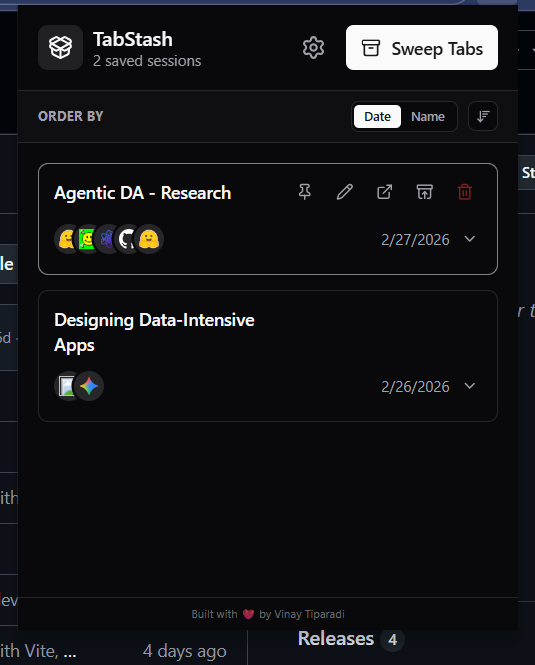
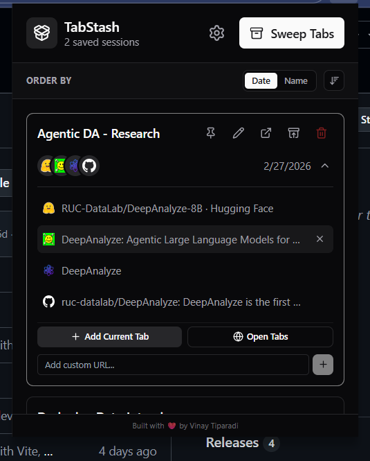
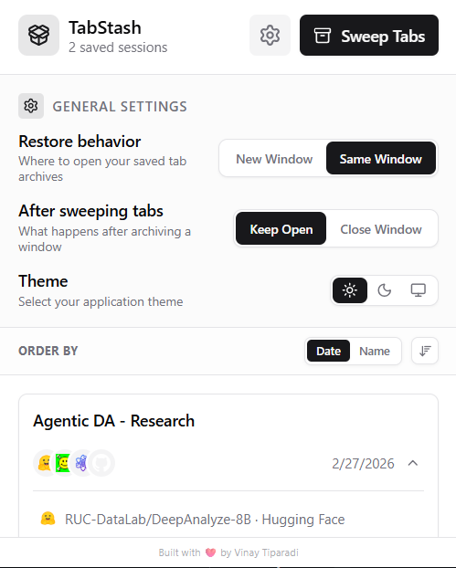

# TabStash Browser Extension

TabStash is a premium, modern browser extension designed to instantly save your open tabs and restore them later. It helps you keep your browser uncluttered while ensuring you never lose important research or sessions.

Supports **Chrome**, **Edge**, **Firefox**, and **Zen Browser**.

## Screenshots

<p align="center">
  
  &nbsp;
  
  &nbsp;
  
</p>

## Features
- **Instant Sweep**: Close and save all your current tabs with a single click.
- **Session Management**: View, restore, or delete past sessions in a clean, dark-mode GUI.
- **Archive Editing**: Expand any archive to view, add, or remove individual tabs.
- **Open Tabs Picker**: Browse all open browser tabs and select which to add to an archive.
- **Privacy First**: All data is saved directly to your local browser storage. No cloud telemetry.

## Installation Instructions

### Chrome / Edge (Developer Mode)

Since this extension is not published to the Chrome/Edge Web Store, you can install it locally using Developer Mode.

#### 1. Download the Latest Release
1. Go to the [Releases](https://github.com/vinaytiparadi/tabstash/releases) page.
2. Download the latest `tabstash-vX.X.X.zip` file.
3. Extract the zip to a folder on your computer (e.g. `tabstash-v1.1.0`).

#### 2. Load into Chrome or Edge
1. Open your browser and navigate to the extensions page:
   - **Chrome**: `chrome://extensions/`
   - **Edge**: `edge://extensions/`
2. Turn on **Developer mode** (usually a toggle in the top right corner or left sidebar).
3. Click the **"Load unpacked"** button.
4. Select the **extracted folder** (the one containing `manifest.json`).
5. The **TabStash** extension will now appear in your list of extensions!

### Firefox / Zen Browser

#### Option 1: Install from .zip
1. Go to the [Releases](https://github.com/vinaytiparadi/tabstash/releases) page.
2. Download the latest `tabstash-mozilla-vX.X.X.zip` file.
3. In your browser, go to `about:config` and set `xpinstall.signatures.required` to `false`.
4. Go to `about:addons`, click the gear icon, and select **"Install Add-on From File..."**.
5. Select the downloaded `.zip` file.

#### Option 2: Load temporarily (for development)
1. Build the Firefox extension (see [Building from Source](#building-from-source) below).
2. Navigate to `about:debugging` in your browser.
3. Click **"This Firefox"** (or **"This Zen"**).
4. Click **"Load Temporary Add-on"** and select `dist-firefox/manifest.json`.

> **Note:** Temporary add-ons are removed when you close the browser.

### Usage
- Click the extension icon in your browser toolbar (pin it for easy access).
- Click **"Sweep Tabs"** to archive all your current tabs.
- To restore tabs, click the **Restore** icon on any saved archive card.

## Updating to a New Version

1. Download the latest release zip for your browser from the [Releases](https://github.com/vinaytiparadi/tabstash/releases) page.
2. **Chrome/Edge**: Extract the zip, replacing the old folder contents. Go to the extensions page and click the reload icon on the TabStash card.
3. **Firefox/Zen**: Go to `about:addons`, remove the old version, and install the new `.zip` file.
4. Your archives and settings are preserved automatically.

## Dismissing the Developer Mode Warning

Since this is a locally loaded extension, your browser may show a warning on startup about running extensions in developer mode.

### Chrome
- A banner will appear saying *"Disable developer mode extensions"*. Simply click **X** to dismiss it each time, or click **"Cancel"** in the dialog.
- Unfortunately Chrome does not allow permanently hiding this warning for unpacked extensions.

### Edge
- Edge may show a popup saying *"Turn off developer extensions"*.
- Click the **"..."** next to the warning and select **"Don't show again"** — Edge allows you to permanently suppress this warning.

## Building from Source

```bash
# Install dependencies
npm install

# Build for Chrome/Edge
npm run build           # Output: dist/

# Build for Firefox/Zen
npm run build:firefox   # Output: dist-firefox/

# Package Firefox build as .zip for distribution
npm run ext:build       # Output: web-ext-artifacts/
```

## Built With
- React 19 & TypeScript
- Vite & `@crxjs/vite-plugin` (Chrome & Firefox)
- Tailwind CSS & Radix UI primitives
- Lucide React (Icons)
